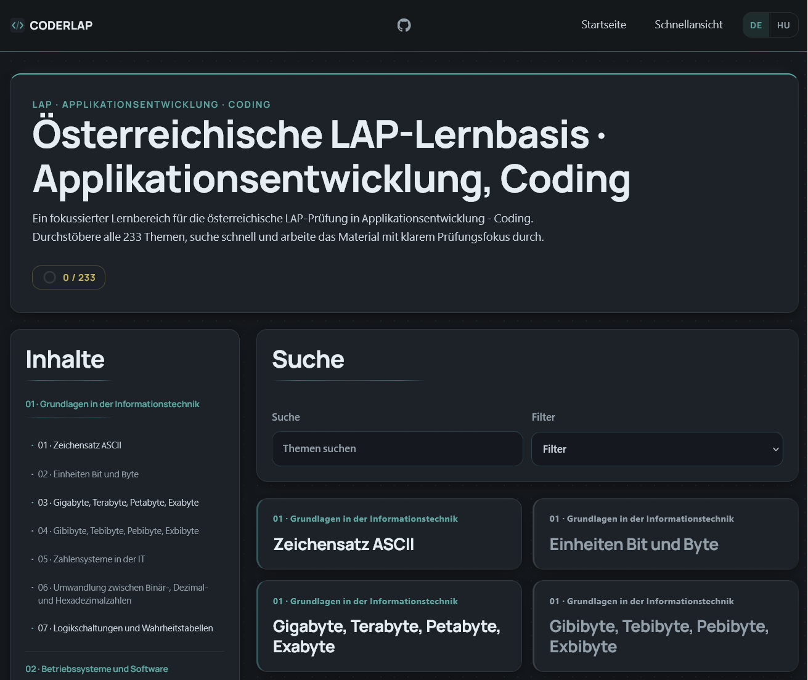

# CoderLAP


`CoderLAP` is a study project for the Austrian `LAP` exam in
`Applikationsentwicklung - Coding`.



This project turns the official topic catalog into a structured knowledge base
with:

- German folder and file names
- bilingual content: German (default) and Hungarian
- `233` subtopic documents fully translated to German (`README.de.md`)
- clean, visual-first Markdown documents
- explicit source lists at the end of each topic
- a working static site generator with i18n support
- generated bilingual search terms with shorthand alias support
- module-level print packs for combined teacher-friendly exports
- live restricted-access delivery at `coderlap.com`
- static site default language: German at `/`, Hungarian at `/hu/`

German is the public default language of the generated site. Hungarian remains
the canonical source corpus used to maintain the content base.

## Source of truth

The project structure is based on:

- `themenkatalog-applikationsentwicklung-coding-v2-2024.pdf`

The canonical learning content remains the existing Hungarian topic `README.md`
corpus, with German translation sidecars in `README.de.md`. For future indexing,
translation mapping, and site-building, the project now also includes:

- `LAP_CONTENT_REGISTRY.json`
- `LAP_CONTENT_REGISTRY.csv`

Operational continuity and formatting rules are documented in:

- [AGENTS.md](./AGENTS.md)

Architecture and delivery notes are documented in:

- [docs/project/content-architecture.md](./docs/project/content-architecture.md)
- [docs/project/architecture-adoption.md](./docs/project/architecture-adoption.md)
- [docs/project/deploy-strategy.md](./docs/project/deploy-strategy.md)
- [docs/project/github-release-hygiene.md](./docs/project/github-release-hygiene.md)
- [docs/project/release-notes-v0.1.0-private-beta.1.md](./docs/project/release-notes-v0.1.0-private-beta.1.md)
- [docs/project/private-rollout-access.md](./docs/project/private-rollout-access.md)
- [docs/project/access-hygiene-playbook.md](./docs/project/access-hygiene-playbook.md)
- [docs/project/pre-public-checklist.md](./docs/project/pre-public-checklist.md)
- [docs/project/next-improvements-checklist.md](./docs/project/next-improvements-checklist.md)
- [docs/project/backup-restore-playbook.md](./docs/project/backup-restore-playbook.md)
- [docs/project/feedback-loop-playbook.md](./docs/project/feedback-loop-playbook.md)
- [docs/process/md013-cleanup-strategy.md](./docs/process/md013-cleanup-strategy.md)

## Project layout

The root contains:

- `18` main topic folders
- `233` subtopic folders
- one `README.md` per subtopic folder as the canonical Hungarian source file
- one `README.de.md` translation sidecar per subtopic folder
- generated registry files for all canonical topic documents
- internal project/deployment docs under `docs/project/`

Example:

```text
01_Grundlagen_in_der_Informationstechnik/
  01_Zeichensatz_ASCII/
    README.md
```

## Current progress

Completed so far:

- full topic folder structure created
- project rules documented in [AGENTS.md](./AGENTS.md)
- main topic `01_Grundlagen_in_der_Informationstechnik` completed
- `7 / 7` subtopic documents created for topic `01`
- main topic `02_Betriebssysteme_und_Software` completed
- `10 / 10` subtopic documents created for topic `02`
- main topic `03_Betreuung_von_mobiler_Hardware` completed
- `6 / 6` subtopic documents created for topic `03`
- main topic `04_Technische_Dokumentation_Projektarbeit_Schulungen` completed
- `6 / 6` subtopic documents created for topic `04`
- main topic `05_Gesetzliche_Bestimmungen` completed
- `16 / 16` subtopic documents created for topic `05`
- main topic `06_Netzwerkdienste` completed
- `13 / 13` subtopic documents created for topic `06`
- main topic `07_IT_Security_und_Betriebssicherheit` completed
- `8 / 8` subtopic documents created for topic `07`
- main topic `08_Informatik_und_Gesellschaft` completed
- `11 / 11` subtopic documents created for topic `08`
- main topic `09_Ergonomischer_Arbeitsplatz` completed
- `6 / 6` subtopic documents created for topic `09`
- main topic `10_Fachberatung_und_Planung` completed
- `5 / 5` subtopic documents created for topic `10`
- main topic `11_Informatik` completed
- `43 / 43` subtopic documents created for topic `11`
- topic `11` was completed in two phases: `01-21` and `22-43`
- main topic `12_Projektmanagement` completed
- `20 / 20` subtopic documents created for topic `12`
- main topic `13_Projektmethoden_und_Tools` completed
- `18 / 18` subtopic documents created for topic `13`
- main topic `14_Qualitaetssicherung` completed
- `7 / 7` subtopic documents created for topic `14`
- main topic `15_Grundkenntnisse_des_Programmierens` completed
- `20 / 20` subtopic documents created for topic `15`
- main topic `16_Datenbanken_Datenmodelle_Datenstrukturen` completed
- `19 / 19` subtopic documents created for topic `16`
- main topic `17_Systementwicklung_und_Testkonzepte` completed
- `13 / 13` subtopic documents created for topic `17`
- main topic `18_Uebungsbeispiel` completed
- `5 / 5` subtopic documents created for topic `18`
- practical reference solution added under
  `18_Uebungsbeispiel/Musterloesung_Minimal`
- total completed topic documents so far: `233`
- stable metadata registry generated for all `233` canonical topic documents
- i18n infrastructure complete: German (default at `/`) and Hungarian (`/hu/`)
- all `233` subtopic documents translated to German as `README.de.md`
- static site generator built with Jinja2, producing bilingual output to `dist/`
- module-level print pack pages generated for all `18` modules
- restricted live delivery active at `coderlap.com`
- GitHub-ready active working copy defined as `C:\GitHub\CoderLAP`

## Content principles

Each topic document should be:

- maintained from Hungarian canonical source content, with German translation
  sidecars for the live frontend
- practical and exam-oriented
- easy to scan quickly
- visually structured with headings, lists, and tables
- backed by modern, trustworthy sources

Preferred source types:

- official documentation
- standards bodies
- official legal and government sources
- widely trusted technical references

Avoid:

- outdated summaries
- random blogs as primary references
- low-quality tutorial sites

## Formatting approach

The default topic format is Markdown-first and designed for later web reuse.

Typical sections include:

- quick summary
- visual overview
- core explanation
- comparison or distinction section
- exam-ready wording
- common mistakes
- self-check questions
- source list

## Architecture status

Useful parts of the architecture plan have already been adopted without
restructuring the finished corpus:

- Markdown remains the source of truth
- the current numbered German folder tree remains unchanged
- stable IDs are provided through the generated content registry
- `.gitignore` and deployment planning are in place for private GitHub use
- the bilingual static site already ships from the current repository

What was deliberately deferred:

- rewriting all topic files with front matter
- migrating to `content/hu` and `content/de`
- building a full validation or static-site pipeline before it is needed

## Roadmap

1. ~~Keep the Markdown corpus stable and review-ready.~~ Done.
2. ~~Continue from the GitHub-ready copy under `C:\GitHub\CoderLAP`.~~ Done.
3. ~~Add i18n-ready structure on top of the registry and current Markdown
   files.~~ Done.
4. ~~Create translated variants.~~ Done — all `233` subtopics translated to
   German.
5. ~~Build a simple HTML/CSS/JS frontend for browsing the full catalog.~~ Done.
6. ~~Deploy the static result through Caddy on `coderlap.com` with a single
   clean delivery path.~~ Done.
7. Continue with operational hardening, print workflow polish, and maintenance
   improvements without changing the static-first architecture.

## Static frontend build

Install dependencies (once per machine):

```bash
pip install -r requirements.txt
```

Build the site:

```bash
python scripts/build_site.py
```

The generated static frontend is written to `dist/` (git-ignored).

Key generated routes include:

- `/` for the German catalog
- `/hu/` for the Hungarian catalog
- `/module-packs/<module-slug>/` for combined module print packs
- `/hu/module-packs/<module-slug>/` for Hungarian module print packs

Start a local preview server on a free local port. Example:

```bash
python -m http.server 8000 --bind 127.0.0.1 --directory dist
```

Then open `http://127.0.0.1:8000/` in a browser.

If you need LAN access from another device on the same network:

```bash
python -m http.server 8000 --bind 0.0.0.0 --directory dist
```

If port `8000` is already in use or behaves inconsistently on your machine,
retry with another free port such as `8001` and update the URL accordingly.

Run the test suite:

```bash
python -m unittest discover -s tests -v
```

### Quick start on a new machine

```bash
git clone https://github.com/goAuD/CoderLAP.git
cd CoderLAP
git checkout dev
pip install -r requirements.txt
python scripts/build_site.py
python -m http.server 8000 --bind 127.0.0.1 --directory dist
```

## Continuing work

If you continue this project in a new Codex thread:

1. Read [AGENTS.md](./AGENTS.md).
2. Check the registry and `docs/project/` notes.
3. Use `C:\GitHub\CoderLAP` as the active working copy.
4. Check what topic folders already contain a `README.md`.
5. Continue within the existing structure.
6. Preserve the German naming + bilingual content structure, with Hungarian as
   canonical source and German as the default frontend language.
7. Keep sources explicit in every topic document.

Short cross-machine continuation note:

- [docs/project/next-thread-handoff.md](./docs/project/next-thread-handoff.md)

## Notes

This is a long-running working project, not just a static notes dump.  
The goal is to end up with a complete, consistent, reusable exam knowledge base
that can later be translated and rendered on the web.
